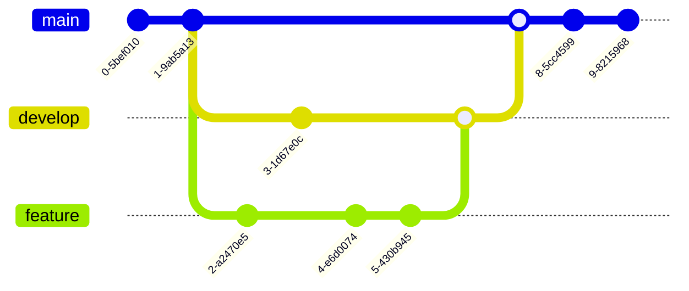
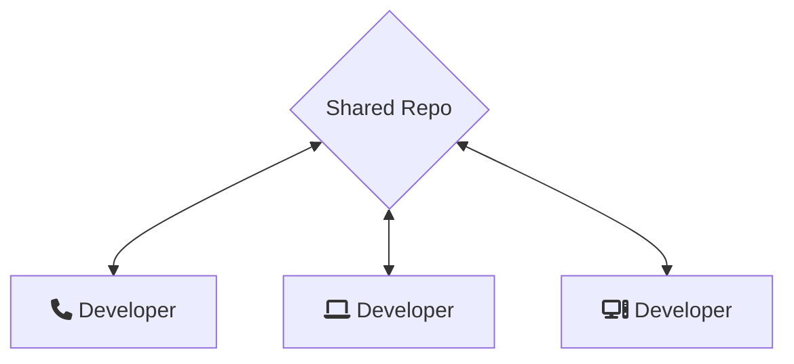
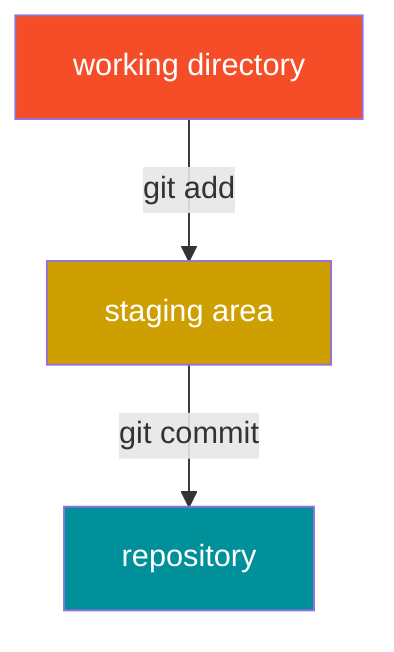

About me
===


Rechner [ˈʀɛçnɐ] (he/him)

* Fox (Very soft)
* Software developer (groan)
  * Dev-ops, specifically
* CTO of Pawprint Prototyping
* Nerd for Telephones

<!-- end_slide -->

What is git?
===

Git is a free and open-source, __Distributed Version Control System (VCS),__
[also known as: Revision Control, Versioning Control, etc.]

* Git tracks versions of files.
* Often used by programmers to manage software development collaboratively.
* Well suited for variety of scales: individual development up to massively parallel efforts.

## Version Control

* A ___version control system___ tracks the history of changes as people collaborate on projects together.
* As changes are made, an earlier version can be recovered at any time.

Developers can review revision history to find the who/what/when/why for changes made.

## A quick history

Git was invented by Linus Torvalds for the development of the Linux Kernel.

Like many cool things in our lives, git was the result of a corporation yanking the rug out from under a well-resourced hacker.

Funny enough, also how Mercurial was born.


<!-- end_slide -->

Basic concepts overview
===

* Repository 
* Staging
* Committing
* Branching
* Merging
* Remotes
  * Pulling
  * Pushing
* Rebasing


<!-- pre-rendered version
 -->




<!-- end_slide -->

Repository
===

A __repository__ is the entire collection of files & folders associated with a project, along with each's revision history.

History appears as snapshots called __commits__.


<!-- pause -->

Because git is a distributed system, repositories are portable simply by moving or syncing the folder which holds the repo.

* Use a flashdrive if you want to
* Every developer has a full copy of the history

<!-- pause -->

Multiple Workflows
===

Centralized



<!-- end_slide -->

Multiple Workflows
===

### Integration manager

Often seen with open source or GitHub repositories.


<!-- pause -->

### Dictator and Lieutenants (Huge projects)


Further reading at https://git-scm.com/about/distributed
<!-- end_slide -->

What about Github?
===

GitHub is a service that makes tools that integrates with Git, such as:
* Pull Request/Code review
* Issues, discussions
* Automatic Workflows (DevOps)

Other options:
* More SaaS:  Bitbucket, GitLab
* And some FOSS self-host alternatives: Gitea, Gogs, GitLab
* `gitweb` also provides a limited web frontend to Git repos

We'll be working with GitHub after we learn some Git basics, but you can always use Git without GitHub!

<!-- end_slide -->

Initializing a local repo
===

I like to have a directory in my home folder to store all of my git projects in:

```bash
mkdir ~/git
cd ~/git
```

Then tell Git to initialize your named repo:
```bash
git init workshop
```

`git init` with no argument will initialize a blank repo inside the current directory, or create one if it doesn't exist.  All of the git-specific data lives in the `.git` folder:

```bash
$ cd workshop
$ ls -la
total 64K
drwxrwxr-x 7 rechner rechner 4.0K Oct 29 11:57 .
drwxrwxr-x 3 rechner rechner 4.0K Oct 29 11:57 ..
drwxrwxr-x 2 rechner rechner 4.0K Oct 29 11:57 branches
-rw-rw-r-- 1 rechner rechner   92 Oct 29 11:57 config
-rw-rw-r-- 1 rechner rechner   73 Oct 29 11:57 description
-rw-rw-r-- 1 rechner rechner   21 Oct 29 11:57 HEAD
drwxrwxr-x 2 rechner rechner 4.0K Oct 29 11:57 hooks
drwxrwxr-x 2 rechner rechner 4.0K Oct 29 11:57 info
drwxrwxr-x 4 rechner rechner 4.0K Oct 29 11:57 objects
drwxrwxr-x 4 rechner rechner 4.0K Oct 29 11:57 refs
```

<!-- end_slide -->

# All the world's a stage...

Git makes use of a __staging area__ or "index".  This is an interstitial area where commits can be formatted and reviewed before completion.

This allows you to stage only portions of a modified file.  Stage only the changes for the current commit and leave changes to commit later.

<!-- pre-rendered

-->



<!-- pause -->

Of course, Git also makes it easy to ignore this feature if you don't want that kind of control with `git commit -a`.


<!-- end_slide -->

Chekov, Status!
===

`git status` will help you get your bearing on the status of your repo.

```bash +exec
git status
```
