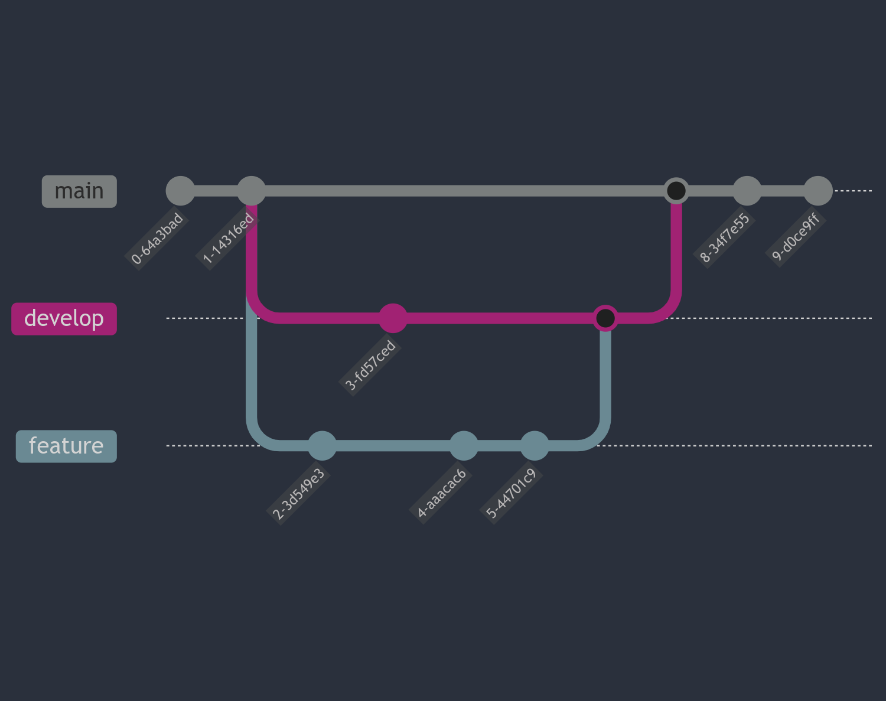

About me
===


Rechner [ˈʀɛçnɐ] (he/him)

* Fox (Very soft)
* Software developer (groan)
  * Dev-ops, specifically
* CTO of Pawprint Prototyping
* Nerd for Telephones

<!-- end_slide -->

What is git?
===

Git is a free and open-source, __Distributed Version Control System (VCS),__
[also known as: Revision Control, Versioning Control, etc.]

* Git tracks versions of files.
* Often used by programmers to manage software development collaboratively.
* Well suited for variety of scales: individual development up to massively parallel efforts.

## Version Control

* A ___version control system___ tracks the history of changes as people collaborate on projects together.
* As changes are made, an earlier version can be recovered at any time.

Developers can review revision history to find the who/what/when/why for changes made.

## A quick history

Git was invented by Linus Torvalds for the development of the Linux Kernel.

Like many cool things in our lives, git was the result of a corporation yanking the rug out from under a well-resourced hacker.

Funny enough, also how Mercurial was born.


<!-- end_slide -->

What's Git Good for?
===

# The obvious:
<!-- incremental_lists: true -->
* Developing software and versioning code
  * Anything you do more than twice, automate it.
* Managing and versioning text-based configuration
* Content for your website without a CMS
* Making a video game with big resources like models (Using LFS)
  * Git Large File Storage is an extension that makes versioning large files efficiently.

<!-- pause -->

# Less common:
* Keeping a journal
* Versioning proprietary or binary file formats
* Writing acadmeic papers
* Tracking changes to legal code
* Versioning multiple installs of Kerbal Space Program
* Explain movie plots [1]
<!-- incremental_lists: false -->

# References
1: https://hashrocket.com/blog/posts/edge-of-tomorrow-explained-in-git

<!-- end_slide -->

Basic concepts overview
===

* Repository 
* Staging
* Committing
* Branching
* Merging
* Remotes
  * Pulling
  * Pushing
* Reset
* Rebase


<!-- pre-rendered version
 -->


<!-- end_slide -->

Repository
===

A __repository__ is the entire collection of files & folders associated with a project, along with each's revision history.

History appears as snapshots called __commits__.


<!-- pause -->

Because git is a distributed system, repositories are portable simply by moving or syncing the folder which holds the repo.

* Use a flashdrive if you want to
* Every developer has a full copy of the history

<!-- pause -->

Multiple Workflows
===

# Centralized


<!-- end_slide -->

Multiple Workflows
===

# Integration manager

Often seen with open source or GitHub repositories.


<!-- pause -->

# Dictator and Lieutenants (Huge projects)


Further reading at https://git-scm.com/about/distributed
<!-- end_slide -->

What about Github?
===

GitHub is a service that makes tools that integrates with Git, such as:
* Pull Request/Code review
* Issues, discussions
* Automatic Workflows (DevOps)

Other options:
* More SaaS:  Bitbucket, GitLab
* And some FOSS self-host alternatives: Gitea, Gogs, GitLab
* `gitweb` also provides a limited web frontend to Git repos

We'll be working with GitHub after we learn some Git basics, but you can always use Git without GitHub!

<!-- end_slide -->

Initializing a local repo
===

I like to have a directory in my home folder to store all of my git projects in:

```bash
mkdir ~/git
cd ~/git
```

Then tell Git to initialize your named repo:
```bash
git init workshop
```

`git init` with no argument will initialize a blank repo inside the current directory.  Here the `workshop` argument will init the `workshop` dir, or create one if it doesn't exist.

<!-- pause -->
All of the git-specific data lives in the `.git` folder:

```bash
$ ls -la .git
total 64K
drwxrwxr-x 7 rechner rechner 4.0K Oct 29 11:57 .
drwxrwxr-x 3 rechner rechner 4.0K Oct 29 11:57 ..
drwxrwxr-x 2 rechner rechner 4.0K Oct 29 11:57 branches
-rw-rw-r-- 1 rechner rechner   92 Oct 29 11:57 config
-rw-rw-r-- 1 rechner rechner   73 Oct 29 11:57 description
-rw-rw-r-- 1 rechner rechner   21 Oct 29 11:57 HEAD
drwxrwxr-x 2 rechner rechner 4.0K Oct 29 11:57 hooks
drwxrwxr-x 2 rechner rechner 4.0K Oct 29 11:57 info
drwxrwxr-x 4 rechner rechner 4.0K Oct 29 11:57 objects
drwxrwxr-x 4 rechner rechner 4.0K Oct 29 11:57 refs
```

<!-- end_slide -->

# All the world's a stage...

Git makes use of a __staging area__ or "index".  This is an interstitial area where commits can be formatted and reviewed before completion.

This allows you to stage only portions of a modified file.  Stage only the changes for the current commit and leave changes to commit later.

<!-- pre-rendered

-->


<!-- end_slide -->

# All the world's a stage... (continued)


Of course, Git also makes it easy to ignore this feature if you don't want that kind of control with `git commit -a`.


<!-- end_slide -->

Chekov, Status!
===

`git status` will help you get your bearing on the status of your repo.

```bash +exec
git status
```

<!-- end_slide -->
RTFM, BTW
===

Git has an excellent built-in help system that describes the extended usage of all of these commands.

Quick reference:

```bash +exec
git help
```

<!-- end_slide -->
Full manual pages:

```bash +exec
git help init
```

<!-- end_slide -->
Staging changes
===

Save yourself a lot of headache with an initial, blank commit.  Make some folders, `touch` 
some empty files, start a README, get the ball rolling!

```bash +exec
touch README.md
git status
```

<!-- end_slide -->
Staging changes
===

Stage your changes by using `git add`, then `status` will show you what's staged:
```bash +exec
git add README.md
git status
```

There's a couple other operations for staging besides `add`:

```bash
# Stage a file for removal from your repo:
git rm hello.c

# Move a file inside your index (e.g. rename)
git mv README.md INSTALL.md
```

Note that for `mv`, git usually will notice if a file gets renamed outside of git and stage the move for you, but it's safer to do `git mv` to make sure the file's commit history comes with it.

<!-- end_slide -->

Committing
===

```bash
git commit -m "First commit"
```

The `-m` flag specifies a **commit message.**
If you run `git commit` with no arguments, git will prompt for a commit message in the default editor (likely Nano).

Type a short, descriptive commit message.  Extended commit messages can be included after a few blank lines with the editor.


<!-- end_slide -->

Committing
===

Git will likely ask you to configure who you are the first time you try to commit:

```
*** Please tell me who you are.

    Run

      git config --global user.email "you@example.com"
      git config --global user.name "Your Name"
```

Note that Git can store configuration either globally, or on a per-repo basis.

After configuring your name and email, run `git commit` again.


<!-- end_slide -->
Committing
===

After committing, we can see the commit history with:

```bash +exec
git log
```

<!-- end_slide -->

Branching
===

Commits can be organized into multiple lines of development called **branches**.

Git allows and encourages you to have multiple local branches that can be entirely independent of each other. The creation, merging, and deletion of those lines of development takes seconds.

This makes it easy to do things like:
<!-- pause -->
<!-- incremental_lists: true -->
* **Effortless context switching**: Create a branch to try out a new idea, switch back, apply a patch, switch back to where you are experimenting, and merge that in.
* **Role-Based code lines**: Have a branch dedicated for production, and several smaller ones for day-to-day work.
* **Feature-based workflows**: Create a new branch for each feature you're working on so you can switch back and forth between them, then delete a feature branch once that's merged into your main line.
* **Disposable experimentation**: Create a branch to experiment in, realize it's not going to work and abandon it without anyone seeing your shame.
<!-- incremental_lists: false -->

Create a branch at any point based on an existing one with `git branch`:

Switch between branches with `checkout` (or the experimiental `switch`)

You can quickly create and checkout a new branch with `checkout -b`:
```bash
git checkout -b rechner/feature
```

<!-- end_slide -->

Default branch
===

Git can configure a default branch, historically called `master`.  It is recommended to use the less antiquated name `main` instead.  The Windows installer may have already asked you this question.

Configure the default branch name globally with:
```bash
git config --global init.defaultBranch main
```

<!-- end_slide -->

Branching (continued)
===

Let's create a new branch and add some changes:

```bash
git checkout -b feature

# Edit README.md to include some new content

# Then, create more files:
touch A.md B.md

# Stage them for commit:
git add README.md A.md B.md

# You can also stage everything untracked with `git add -a`
```

<!-- end_slide -->

Check where you are with `status:`

```bash +exec
git status
```

Create a commit on your new branch:
```bash
git commit -m "Added new feature"
```

List branches:
```bash
git branch
```

<!-- end_slide -->
Merging
===

`git merge` incorporates changes from the named commits into the current branch.

There's a variety of strategies for merging changes (git will usually pick the best one for you).

```
    commit
    commit
    branch feature
    commit
    commit
    checkout main
    commit
    commit
    merge feature
```


<!-- end_slide -->

Fuck, go back!
===

# Checkout the past
You can check out a past commit with `checkout` and the commit SHA.  Look back through the commit history with `log`, and drill down to changes with `show`.

A **commit SHA** is a cryptographic hash which identifies commits uniquely, as a part of git's data integrity.
Impossible to change any file, date commit message, without changing the IDs of everything after it.

It can be long, like `1d4ba2708c30dde9243743c759bcf75ef11f95c1`, or abbreviated to the first ~7 or so characters like `1d4ba27`.

<!-- pause -->

You can temporarily check out any past commit by referencing its SHA:

```bash
git checkout 1d4ba27
```

This will get you into a so-called "floating head" state.  What you do from there is up to you:
* Make changes
* Base a new branch from this point
* Use a `revert` commit to remove changes introduced by a commit
* Something more permanent...

<!-- pause -->

# Checkout specific files

`checkout` can also be used to restore only certain paths/files to a previous commit:

```bash
git checkout cf2352 -- main.c resources/sounds
git checkout origin/main -- src/hello.rs
```

<!-- end_slide -->

Git demystified
===

## The Three Trees

Git as a system manages and manipulates three trees in its normal operation:

|Tree | Role |
|-----|------|
|HEAD| Last commit snapshot, next parent|
|Index| Proposed next commit snapshot|
|Working directory| Sandbox |


### HEAD
The **HEAD** is a pointer to the current branch reference, which in turn is a pointer to the last commit made on that branch.

This means HEAD will be the parent of the next commit.  (Think of this as the snapshot of your last commit on that branch.)
<!-- pause -->

### Index
The **index** is your **proposed next commit**, or the "staging" area.  This is what Git looks at when you run `git status` or `git commit`.

<!-- pause -->
### The Working Directory
While the other two "trees" store their content in the .git folder, the **working directory** or **working tree** unpacks them into actual files that you can work on.  It's the sandbox where you can try changes out before committing them to staging and eventually the history.

<!-- pause -->
## Reset

These terms will be important for using `git reset` later when undoing some operations with git, including unstaging changes for commit, or discarding working changes.

<!-- end_slide -->

Remotes
===
A git `remote` lets git sync your local repo with other developers.  A remote can be another folder on your machine, but is most useful as a network remote supported by some optional protocols:
* SSH
* HTTP(S)
* git protocol (bad and deprecated, don't use this!)

I recommend sticking to **SSH** with remotes like Github.  Set up an SSH key so you don't have to type your password every time.

Remotes enable these operations:
 * `pull`
 * `push`

You can check what remotes are configured for a repo with:
```bash +exec
git remote -v
```

<!-- end_slide -->
Cloning
===

Cloning will likely cover 80% of git operations as a maker trying out or getting started contributing to someone else's cool project.

You'll need the URL for the repo, for HTTP it looks like a link like this:

```
https://github.com/USER/REPO.git
```

For SSH, it looks like this:

```
git@github.com:/USER/REPO.git
```

Then clone the repo:

```bash
git clone git@github.com:/USER/REPO.git [destination]
```

<!-- end_slide -->
Reset
===


<!-- end_slide -->
Reset
===

`reset` is used to reset index entries for particular paths.

```
# The opposite of `git add README.md`:
git reset README.md

# Reset in this form resets the current branch head to <commit>
git reset --soft v0.1
```

A soft reset does not touch the index file or working tree
at all (but only resets HEAD to the named commit).  This leaves all your changed files "Changes to be committed".


